# Заготовка для социальной сети

## Домашнее задание №1 Проблемы высоких нагрузок

### Как запустить приложение
* Gradle task -> dockerBuildImage соберет образ приложения otus-app
* Gradle task -> composeUp выполнит запуск docker compose

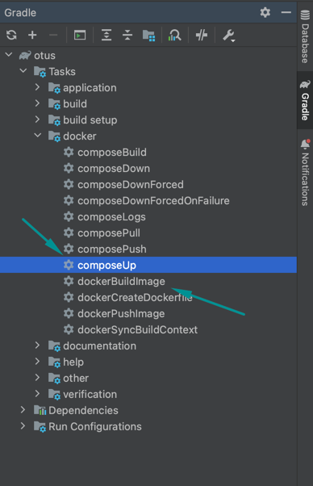

## Домашнее задание №2 Индексы (часть 2)
### (опционально) генерация тестовых данных;
#### Использован набор тестовых данных для проведения нагрузочного тестирования
* Файл people.csv предварительно был отредактирован, чтобы каждое значение для колонки было разделено по отдельным колонкам (через символ ";")
* С помощью Liquibase функционала loadData https://docs.liquibase.com/change-types/load-data.html загружается список пользователей из файла people.csv 
### работа с индексами
* Запрос Find which tables use INNODB with MySQL
```
SELECT table_schema, table_name, engine
FROM INFORMATION_SCHEMA.TABLES
WHERE engine = 'innodb';
```
### нагрузочное тестирование
Проведено в jMeter

## Домашнее задание №3 Репликация (часть 3)
За основу взяты скрипты из https://github.com/OtusTeam/highload/blob/master/lessons/02/05/live/guide.md
# Репликация в PostgreSQL
## Физическая репликация
docker exec -it master_db su - postgres -c psql
1. Создаем сеть в docker-compose, запоминаем адрес
    ```shell
    networks:
      otus_pgnetwork:
   
    docker network ls
    docker network create otus_pgnetwork
    docker network inspect otus_pgnetwork | grep Subnet 
   # Запомнить маску сети 172.19.0.0/16
    ```

2. Поднимаем мастер в docker-compose
```
   docker run -dit -v "$PWD/db_volume/master_db/:/var/lib/postgresql/data" -e POSTGRES_PASSWORD=postgres -p "5432:5432" --restart=unless-stopped --network=otus_pgnetwork --name=master_db postgres
   ```
3. Меняем postgresql.conf на мастере
    ```conf
    ssl = off#
    wal_level = replica
    max_wal_senders = 4 # expected slave num
    ```

4. Подключаемся к мастеру и создаем пользователя для репликации
Также добавили скрипт в db_volume/init.sql, который делает то же самое
    ```shell
    docker exec -it master_db su - postgres -c psql
    create role replicator with login replication password 'pass'; 
    select * from pg_roles where rolname = 'replicator';
    exit
    ```

5. Добавляем запись в `master_db/pg_hba.conf` с `subnet` с первого шага
    ```
    host    replication     replicator       __SUBNET__          md5
    host    replication     replicator       172.19.0.0/16       md5
    ```

6. Перезапустим мастер
    ```shell
    docker restart master_db
    ```

7. Сделаем бэкап для реплик
    ```shell
    docker exec -it master_db bash
    mkdir /replica_backup
    pg_basebackup -h master_db -D /replica_backup -U replicator -v -P --wal-method=stream
    exit
    ```

8. Копируем директорию себе в реплику replica_db_1
    ```shell
    docker cp master_db:/replica_backup db_volume/replica_db_1
    ```

9. Создадим файл, чтобы реплика узнала, что она реплика
    ```shell
    Windows:
    C:\Docker\volumes\replica_db_1\standby.signal
    Mac:
    touch db_volume/replica_db_1/standby.signal
    ```

10. Меняем `postgresql.conf` на реплике `replica_db_1`
    ```conf
    primary_conninfo = 'host=master_db port=5432 user=replicator password=pass application_name=replica_db_1'
    ```

11. Запускаем реплику `replica_db_1` - указано в docker-compose.yml
    ```shell
    docker run -dit -v "$PWD/db_volume/replica_db_1/:/var/lib/postgresql/data" -e POSTGRES_PASSWORD=pass -p "15432:5432" --network=otus_pgnetwork --restart=unless-stopped --name=replica_db_1 postgres
    ```
    
12. Запустим вторую реплику `replica_db_2`
  - скопируем бэкап
      ```shell
      docker cp master_db:/replica_backup db_volume/replica_db_2/
      ```

  - изменим настройки `replica_db_2/postgresql.conf`
      ```conf
      primary_conninfo = 'host=master_db port=5432 user=replicator password=pass application_name=replica_db_2'
      ```

  - дадим знать что это реплика
      ```shell
     Windows:
     C:\Docker\volumes\replica_db_2\standby.signal
     Mac:
      touch db_volume/replica_db_2/standby.signal
      ```

  - запустим реплику `replica_db_2`  - указано в docker-compose.yml
    (Перезапустим replica_db_2)
      ```shell
        docker restart replica_db_2
    
        docker run -dit -v "$PWD/db_volume/replica_db_2/:/var/lib/postgresql/data" -e POSTGRES_PASSWORD=pass -p "25432:5432" --network=otus_pgnetwork --restart=unless-stopped --name=replica_db_2 postgres
   
        ```

14. Убеждаемся что обе реплики работают в асинхронном режиме на `master_db`
    ```shell
    docker exec -it master_db su - postgres -c psql
    select application_name, sync_state from pg_stat_replication;
    exit;
    ```
### Настроить кворумную синхронную репликацию.
1. Включаем синхронную репликацию на `master_db`
    - меняем файл `db_volume/master_db/postgresql.conf`
        ```conf
        synchronous_commit = on
        synchronous_standby_names = 'FIRST 1 (replica_db_1, replica_db_2)'
        ```

    - перечитываем конфиг
        ```shell
        docker exec -it master_db su - postgres -c psql
        select pg_reload_conf();
        exit;
        ```

2. Убеждаемся, что реплики стала синхронными
    ```shell
    docker exec -it master_db su - postgres -c psql
    select application_name, sync_state from pg_stat_replication;
    exit;
    ```

3. Укладываем репилку `replica_db_2` и проверяем работу `master_db` и `replica_db_1`
    ```shell
    docker stop replica_db_2
    docker exec -it master_db su - postgres -c psql
    select application_name, sync_state from pg_stat_replication;
    insert into test(id) values(2);
    select * from test;
    exit;
    docker exec -it replica_db_1 su - postgres -c psql
    select * from test;
    exit;
    ```
4. Создадим тестовую таблицу на `master_db` и проверим репликацию
    ```shell
    docker exec -it master_db su - postgres -c psql
    create table test(id bigint primary key not null);
    insert into test(id) values(2);
    select * from test;
    exit;

5. Возвращаем вторую реплику `replica_db_2`
    ```shell
    docker start replica_db_2
    ```
6. Убиваем мастер `master_db`
    ```shell
    docker stop master_db
    ```
7. Запромоутим реплику `replica_db_1`
    ```shell
    docker exec -it replica_db_1 su - postgres -c psql
    select pg_promote();
    exit;
    ```
8. Настраиваем репликацию на `replica_db_1` (`replica_db_1/postgresql.conf`)
    - изменяем конфиг
        ```conf
        synchronous_commit = on
        synchronous_standby_names = 'ANY 1 (master_db, replica_db_2)'
        ```
    - перечитываем конфиг
        ```shell
        docker exec -it replica_db_1 su - postgres -c psql
        select pg_reload_conf();
        exit;
        ```

9. Подключим вторую реплику `replica_db_2` к новому мастеру `replica_db_1`
    - изменяем конфиг `replica_db_2/postgresql.conf`
        ```conf
        primary_conninfo = 'host=replica_db_1 port=5432 user=replicator password=pass application_name=replica_db_2'
        ```
    - перечитываем конфиг
        ```shell
        docker exec -it replica_db_2 su - postgres -c psql
        select pg_reload_conf();
        exit;
        ```
10. Проверяем что к новому мастеру `replica_db_1` подключена реплика и она работает
    ```shell
    docker exec -it replica_db_1 su - postgres -c psql
    select application_name, sync_state from pg_stat_replication;
    exit;
    ```
11. Восстановим старый мастер `master_db` как реплику
    1. Помечаем как реплику
        ```shell
        touch db_volume/master_db/standby.signal
        ```
    2. Изменяем конфиг `master_db/postgresql.conf`
        ```conf
        primary_conninfo = 'host=replica_db_1 port=5432 user=replicator password=pass application_name=master_db'
        ```
    3. Запустим `master_db`
       ```shell
        docker start master_db
        ```
    4. Убедимся что `master_db` подключился как реплика к `replica_db_1`
        ```shell
        docker exec -it replica_db_1 su - postgres -c psql
        select application_name, sync_state from pg_stat_replication;
        exit;
        ```

## Домашнее задание №4 Кеширование
* В /login API добавлена генерация токена - в куки X-Auth
Требуется ручная очистка куки 
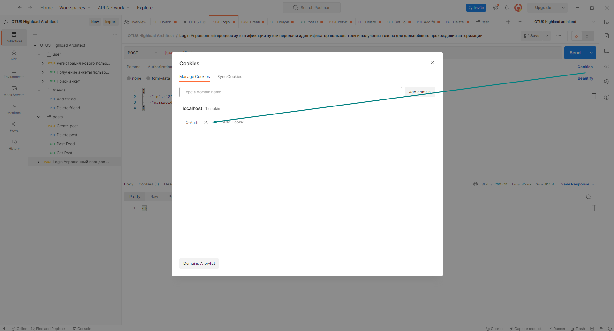
* Добавлены апи на добавление и удаление друзей
```
PUT {{baseUrl}}/friend/add/{id}
PUT {{baseUrl}}/friend/delete/{id}
```
* Добавлены апи на создание и удаление постов
```
POST {{baseUrl}}/post/create
PUT {{baseUrl}}/post/delete?{id}
```
* Добавлено апи на получение ленты новостей друзей
```
GET {{baseUrl}}/post/feed?offset=0&limit=50
```
Формирование кеша основано на [caching in a Spring application](https://www.baeldung.com/spring-cache-tutorial)
Кэш - объект ConcurrentMapCacheManager с ключом "friendPosts"
Представляет собой map:
key - userId, value - list<Post>
* Инвалидация кеша происходит в следующих случаях
  * 1 Добавление или удаление друзей у текущего пользователя - инвалидируется значение в кеше для userId
  * 2 Добавление или удаление постов у текущего пользователя - инвалидируется значение в кеше для пользователей, являющихся друзьями текушего userId

## Домашнее задание #5 Масштабируемая подсистема диалогов
Использован Citus как инструмент для шардирования Postgresql 
1. При подключении Liquibase ожидаем создание базы данных 'db', но в Citus автоматическое создание не срабатывает, поэтому добавили скрипт
sharding/init.sql 
```
CREATE DATABASE DB;
``` 

2. Подключимся к координатору:
```
docker exec -it socialnetwork_master psql -U postgres

\l # see all databases
\dt # see all tables
``` 
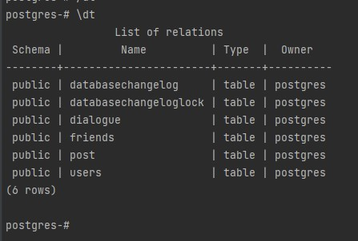

3. Создадим из таблицы dialogue распределенную (шардированную) таблицу:
[Документация](https://citus-doc.readthedocs.io/en/latest/develop/api_udf.html)

SELECT create_distributed_table('dialogue', 'dialogue_id');

Так как существует внешний ключ к таблице users, возникает ошибка
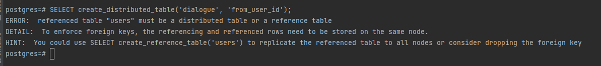

Референсная таблица создает копии данных на каждом узле. В случае таблицы users - это решение не является эффективным.
Поэтому для обеспечения большей производительности удалим fk_from_user_id и fk_to_user_id для таблицы dialogue. 
По-хорошему, стоит развить приложение, чтобы при удалении пользователя производить запросы на удаление связанных с ним диалогов (при условии, что оба юзера более не существуют в системе)?

А также удалим PRIMARY KEY для таблицы dialogue, чтобы обеспечить возможность шардировать по колонке, которая не имеет констрейты (не является UNIQUE, PRIMARY или EXCLUDE значением)
https://github.com/citusdata/citus/issues/4656

SELECT shard_count FROM citus_tables WHERE table_name::text = 'dialogue';
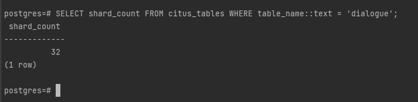

4. Процесс решардинга без даунтайма
Использован инструмент Citus
``` 
   explain select * from dialogue limit 10;
   
   postgres=# explain select * from dialogue limit 10;
                                             QUERY PLAN                                              
-----------------------------------------------------------------------------------------------------
 Limit  (cost=0.00..0.00 rows=10 width=564)
   ->  Custom Scan (Citus Adaptive)  (cost=0.00..0.00 rows=100000 width=564)
         Task Count: 32
         Tasks Shown: One of 32
         ->  Task
               Node: host=socialnetwork-worker-1 port=5432 dbname=postgres
               ->  Limit  (cost=0.00..0.87 rows=10 width=564)
                     ->  Seq Scan on dialogue_102008 dialogue  (cost=0.00..11.30 rows=130 width=564)

``` 
Посмотрим план запроса по конкретному id. Видим, что такой select отправится только на один из шардов:
``` 
explain select * from dialogue where dialogue_id = 1 limit 10;

                                        QUERY PLAN
---------------------------------------------------------------------------------------------
 Custom Scan (Citus Adaptive)  (cost=0.00..0.00 rows=0 width=0)
   Task Count: 1
   Tasks Shown: All
   ->  Task
         Node: host=socialnetwork-worker-1 port=5432 dbname=postgres
         ->  Limit  (cost=0.00..11.62 rows=1 width=564)
               ->  Seq Scan on dialogue_102073 dialogue  (cost=0.00..11.62 rows=1 width=564)
                     Filter: (dialogue_id = 1)
(8 rows)

``` 
Добавим еще парочку шардов:
```  in Windows:
docker-compose -p socialnetwork up --scale worker=5 -d
``` 
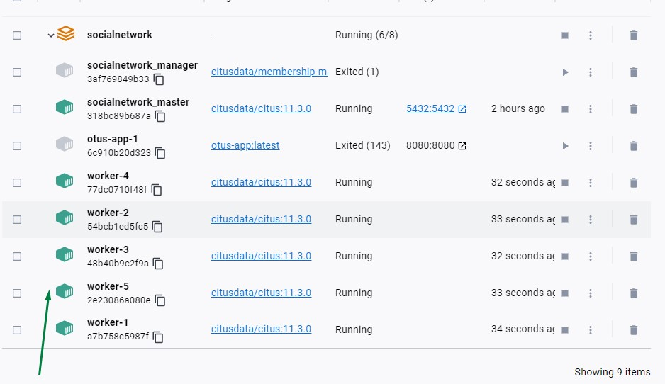
Посмотрим, видит ли координатор новые шарды:
``` 
docker exec -it socialnetwork_master psql -U postgres
SELECT master_get_active_worker_nodes();
``` 
У меня не видит координатор новые узлы Citus, поэтому я делаю restart - аналогично было предложено сделать в лекции
``` 
docker-compose restart
docker exec -it socialnetwork_master psql -U postgres
SELECT master_get_active_worker_nodes();
```
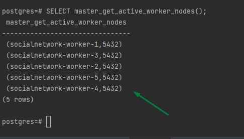

Проверим, на каких узлах лежат сейчас данные:
```
SELECT nodename, count(*) FROM citus_shards GROUP BY nodename;

        nodename        | count 
------------------------+-------
 socialnetwork-worker-1 |    32
(1 row)
```
Видим, что данные не переехали на новые узлы, надо запустить перебалансировку.
Для начала установим wal_level = logical чтобы узлы могли переносить данные:
```
docker exec -it socialnetwork_master psql -U postgres
alter system set wal_level = logical;
SELECT run_command_on_workers('alter system set wal_level = logical');
```
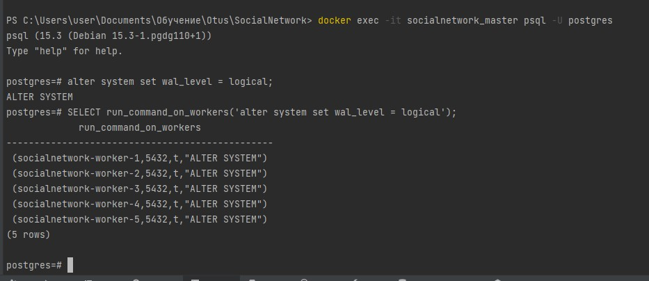

Перезапускаем все узлы в кластере, чтобы применить изменения wal_level.
Проверим, что wal_level изменился:
``` 
docker-compose restart
docker exec -it socialnetwork-worker-1 psql -U postgres
show wal_level;
``` 
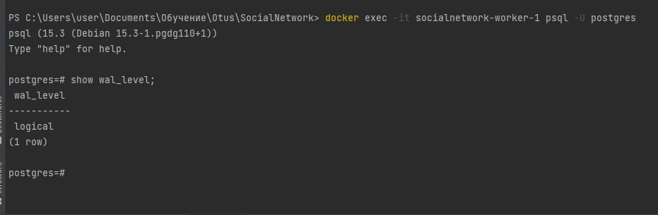

Запустим ребалансировку:
``` 
docker exec -it socialnetwork_master psql -U postgres
SELECT citus_rebalance_start();
``` 

Возникает ошибка https://www.citusdata.com/updates/v11-1/
```
ERROR:  cannot use logical replication to transfer shards of the relation dialog
ue since it doesn't have a REPLICA IDENTITY or PRIMARY KEY
DETAIL:  UPDATE and DELETE commands on the shard will error out during logical r
eplication unless there is a REPLICA IDENTITY or PRIMARY KEY.
HINT:  If you wish to continue without a replica identity set the shard_transfer
_mode to 'force_logical' or 'block_writes'.

SELECT citus_rebalance_start(shard_transfer_mode => 'force_logical');
```
Следим за статусом ребалансировки, пока не увидим там state "finished"
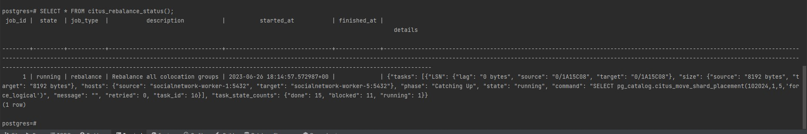
``` 
SELECT * FROM citus_rebalance_status();

postgres=# SELECT * FROM citus_rebalance_status();
 job_id |  state   | job_type  |           description           |          started_at           |          finished_at          |                     details                      
--------+----------+-----------+---------------------------------+-------------------------------+-------------------------------+--------------------------------------------------
      1 | finished | rebalance | Rebalance all colocation groups | 2023-06-26 18:14:57.572987+00 | 2023-06-26 18:16:00.441532+00 | {"tasks": [], "task_state_counts": {"done": 27}}
(1 row)

``` 
Проверяем, что данные равномерно распределились по шардам:
``` 
SELECT nodename, count(*) FROM citus_shards GROUP BY nodename;
``` 
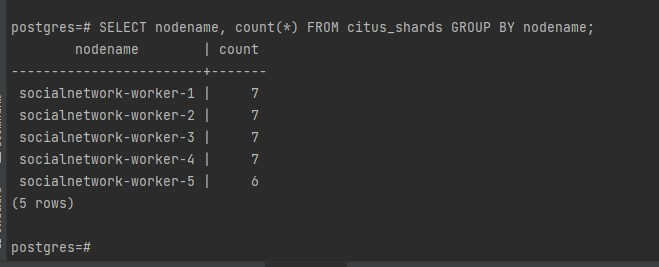

API работает через POSTMAN
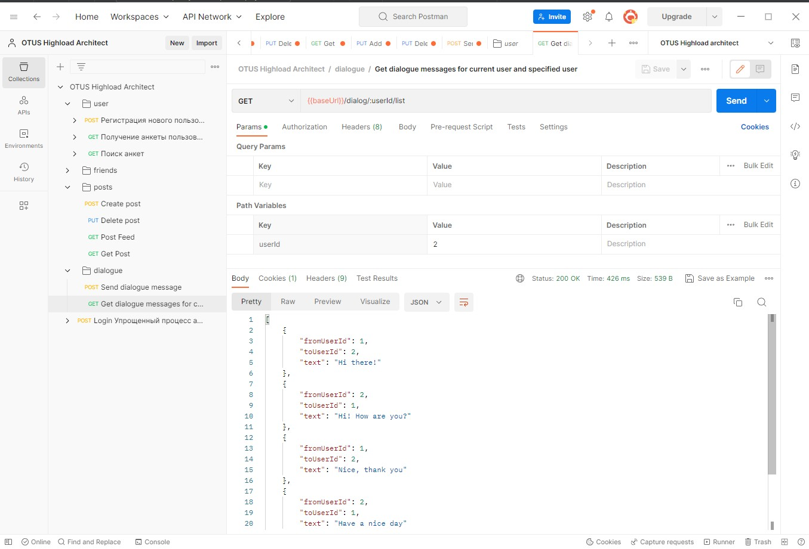

5. “Эффект Леди Гаги” (один пользователь пишет сильно больше среднего)
   Для небалансированных данных (когда конкретные пользователи пишут сильно больше среднего количества сообщений) хотелось бы предусмотреть возможность шардирования по нескольким колонкам. Например, для таблицы dialogue шардировать по ключам from_user_id+to_user_id, чтобы диалог между конкретными двумя людьми находился в одином шарде.
   Но в таком решении аналогично может возникнуть несбаланированный шардинг при наличии очень объемной переписки.
   Однако, насколько я обнаружила, [Citus не поддерживает шардирование по нескольким колонкам](https://stackoverflow.com/questions/37009048/how-do-i-distributed-a-table-using-values-from-multiple-columns)
   Можно было бы создать композитный ключ для таблицы dialogue по dialogue_id и дате https://gist.github.com/sumedhpathak/b8d4d46a656dbc58f364
   Create the type on the master and all worker nodes:
``` 
    docker exec -it socialnetwork_master psql -U postgres
    CREATE TYPE dialogue_composite_type as (dialogue_id text, created_date text);
```   
Create a function for checking equality, and associate it with the equality operator for the new type
``` 
CREATE FUNCTION equal_test_composite_type_function(dialogue_composite_type, dialogue_composite_type) RETURNS boolean
AS 'select $1.dialogue_id = $2.dialogue_id AND $1.created_date = $2.created_date;'
LANGUAGE SQL
IMMUTABLE
RETURNS NULL ON NULL INPUT;

-- ... use that function to create a custom equality operator...
CREATE OPERATOR = (
LEFTARG = dialogue_composite_type,
RIGHTARG = dialogue_composite_type,
PROCEDURE = equal_test_composite_type_function,
HASHES
);
``` 
Create a new hash function. Note: This is just a simple example which may not provide a good even hash distribution. There are several examples of good hash functions which can be implemented in a separate C function instead of SQL.
``` 
CREATE FUNCTION new_composite_type_hash(dialogue_composite_type) RETURNS int
AS 'SELECT hashtext( ($1.dialogue_id || $1.created_date)::text);'   
LANGUAGE SQL
IMMUTABLE
RETURNS NULL ON NULL INPUT;
``` 
Define operator classes for the BTREE and HASH access methods:
``` 
CREATE OPERATOR CLASS new_op_fam_btree_class
DEFAULT FOR TYPE dialogue_composite_type USING BTREE AS
OPERATOR 3 = (dialogue_composite_type, dialogue_composite_type);

CREATE OPERATOR CLASS new_op_fam_hash_class
DEFAULT FOR TYPE dialogue_composite_type USING HASH AS
OPERATOR 1 = (dialogue_composite_type, dialogue_composite_type),
FUNCTION 1 new_composite_type_hash(dialogue_composite_type);
``` 
Create the table with the new type and distribute it.
``` 
CREATE TABLE composite_type_partitioned_dialogue_table
(
id integer,
composite_column dialogue_composite_type,
from_user_id integer,
to_user_id integer,
text text
);

INSERT INTO composite_type_partitioned_dialogue_table VALUES  (1, 
'("dialogue1", "20160101")'::dialogue_composite_type, 1, 2, 'Hello!');


EXPLAIN SELECT * FROM composite_type_partitioned_dialogue_table;                                         QUERY PLAN                                          
---------------------------------------------------------------------------------------------
 Seq Scan on composite_type_partitioned_dialogue_table  (cost=0.00..17.80 rows=780 width=76)
(1 row)
SELECT * FROM composite_type_partitioned_dialogue_table WHERE composite_column = '("dialogue1", "20160101")'::new_composite_type;

SELECT create_distributed_table('composite_type_partitioned_dialogue_table', 'composite_column', 'hash');
``` 

Но на этом шаге (create_distributed_table) я встречаю ошибку
ERROR:  could not find function for data typeId 17254
Быстро решение не нашла, так что до конца довести решениие с композитным ключом не удалось

## Домашнее задание #6 Онлайн обновление ленты новостей
### Реализован функционал
* Создание поста (метод /post/create из спецификации)
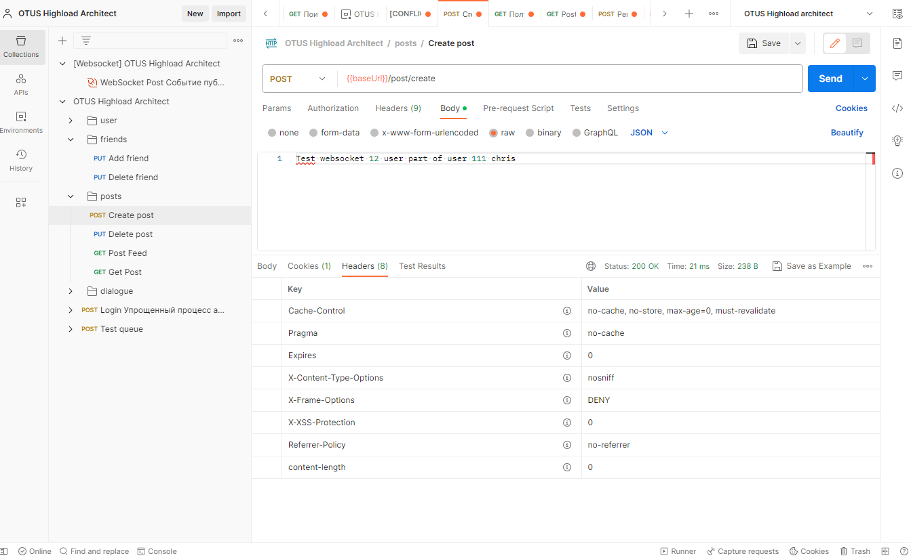
* Отправка сообщений в канал /post/feed/posted через websocket согласно спецификации
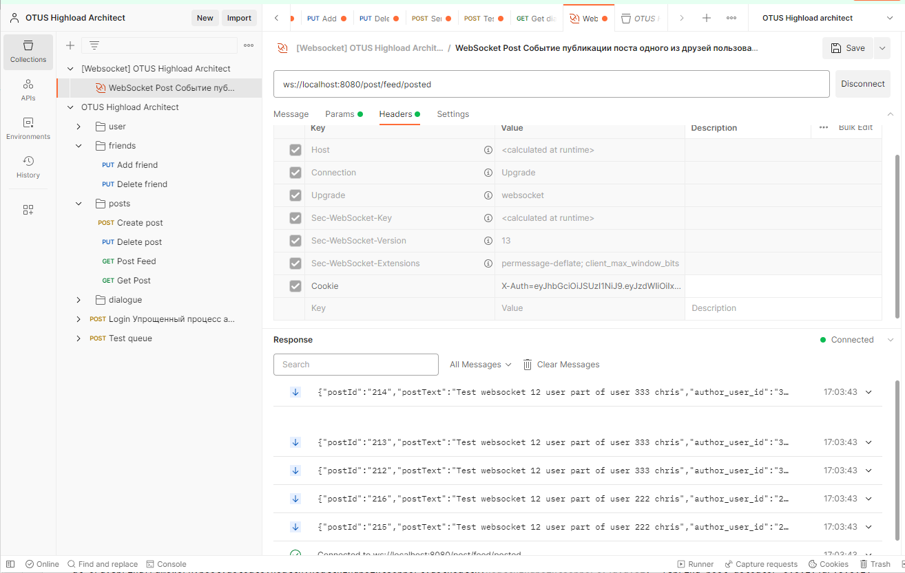


Настроен exchange 'tweet.published', в который поступают посты при публикации. С помощью routing-key = userId пользователя-публикатора поста, настраиваются bindings между exchange и топиками с названием "post-feed.user-<userId>".  
При входе в систему (вызове API /login) происходит создание топиков и связывание с exchange. При подключении через websocket к ленте новостей, происходит подписка на топики друзей текущего пользователя.
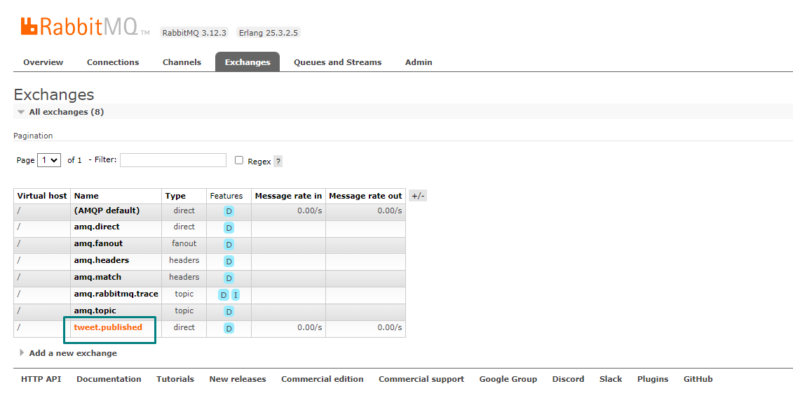
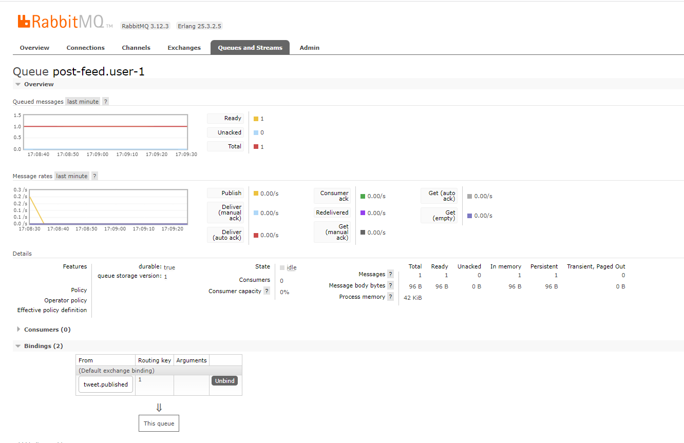

#### Комментарии к текущему решению
* Очередь сообщений формируется на запись для каждого пользователя-публикатора
* При получении сообщения из ленты друзей одним из подписчиков и acknowledge, сообщение помечается прочитанным, и для др пользователей в ленте уже не будет отражено