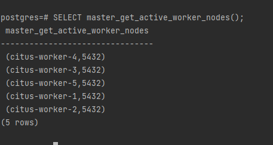
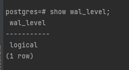

# Шардирование

1)  Скачаем docker-compose.yml, которым будем пользоваться в дальнейшем.

curl https://raw.githubusercontent.com/citusdata/docker/master/docker-compose.yml > docker-compose.yml

2) POSTGRES_PASSWORD=pass docker-compose -p citus up --scale worker=2 -d

3)  Подключимся к координатору:

docker exec -it citus_master psql -U postgres

4) Создадим таблицу

CREATE TABLE test (
    id bigint NOT NULL PRIMARY KEY,
    data text NOT NULL
);

5) Создадим из нее распределенную (шардированную) таблицу:

SELECT create_distributed_table('test', 'id');

SELECT shard_count FROM citus_tables WHERE table_name::text = 'test';

6) Наполним данными:
insert into test(id, data)
select
    i,
    md5(random()::text)
from generate_series(1, 1000000) as i;

7) Посмотрим план запроса. Видим, что select теперь распределенный и пойдет на все шарды:

explain select * from test limit 10;
                                          QUERY PLAN
-----------------------------------------------------------------------------------------------
 Limit  (cost=0.00..0.00 rows=10 width=40)
   ->  Custom Scan (Citus Adaptive)  (cost=0.00..0.00 rows=100000 width=40)
         Task Count: 32
         Tasks Shown: One of 32
         ->  Task
               Node: host=citus-worker-1 port=5432 dbname=postgres
               ->  Limit  (cost=0.00..0.18 rows=10 width=40)
                     ->  Seq Scan on test_102008 test  (cost=0.00..649.00 rows=35400 width=40)

8) Посмотрим план запроса по конкретному id. Видим, что такой select отправится только на один из шардов:

explain select * from test where id = 1 limit 10;
                                                 QUERY PLAN
------------------------------------------------------------------------------------------------------------
 Custom Scan (Citus Adaptive)  (cost=0.00..0.00 rows=0 width=0)
   Task Count: 1
   Tasks Shown: All
   ->  Task
         Node: host=citus-worker-2 port=5432 dbname=postgres
         ->  Limit  (cost=0.29..8.30 rows=1 width=41)
               ->  Index Scan using test_pkey_102009 on test_102009 test  (cost=0.29..8.30 rows=1 width=41)
                     Index Cond: (id = 1)

9) Добавим еще парочку шардов:

POSTGRES_PASSWORD=pass docker-compose -p citus up --scale worker=5 -d

10) Посмотрим, видит ли координатор новые шарды:

SELECT master_get_active_worker_nodes();

У меня не видит координатор новые узлы Citus, поэтому я делаю restart - аналогично было предложено сделать в лекции 

docker-compose restart

11) Проверим, на каких узлах лежат сейчас данные:

SELECT nodename, count(*) 
FROM citus_shards GROUP BY nodename;

12) Видим, что данные не переехали на новые узлы, надо запустить перебалансировку.

13) Для начала установим wal_level = logical чтобы узлы могли переносить данные:

alter system set wal_level = logical;
SELECT run_command_on_workers('alter system set wal_level = logical');

15) Перезапускаем все узлы в кластере, чтобы применить изменения wal_level.

POSTGRES_PASSWORD=pass docker-compose restart

16) Проверим, что wal_level изменился:

docker exec -it citus-worker-1 psql -U postgres

show wal_level;

17) Запустим ребалансировку:

docker exec -it citus_master psql -U postgres

SELECT citus_rebalance_start();

18) Следим за статусом ребалансировки, пока не увидим там соообщение "task_state_counts": {"done": 18}

SELECT * FROM citus_rebalance_status();

19) Проверяем, что данные равномерно распределились по шардам:

SELECT nodename, count(*)
FROM citus_shards GROUP BY nodename;

20) Создадим референсную таблицу:

CREATE TABLE test_reference (
    id bigint NOT NULL PRIMARY KEY,
    data text NOT NULL
);

select create_reference_table('test_reference');

insert into test_reference values(1, 'a');
insert into test_reference values(2, 'b');
insert into test_reference values(3, 'c');
insert into test_reference values(4, 'd');
insert into test_reference values(5, 'e');

select * from test join test_reference on test.id = test_reference.id limit 10;

explain select * from test join test_reference on test.id = test_reference.id where test.id = 1 limit 10;

21) Создадим связанные таблицы:
CREATE TABLE test_colocate (
    id bigint NOT NULL PRIMARY KEY,
    data text NOT NULL
);

SELECT create_distributed_table('test_colocate', 'id', colocate_with => 'test');

insert into test_colocate(id, data)
select
    i,
    'colocate'
from generate_series(1, 1000000) as i;

explain select * from test join test_colocate on test.id = test_colocate.id limit 10;

explain select * from test join test_colocate on test.id = test_colocate.id where test.id = 1 limit 10;

22) Создадим локальную таблицу и попробуем сджойнить:

CREATE TABLE test_local (
    id bigint NOT NULL PRIMARY KEY,
    data text NOT NULL
);

insert into test_local values(1, 'a');

explain select * from test join test_local on test.id = test_local.id where test.id = 1 limit 10;
